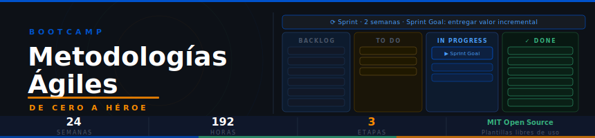

<p align="center">
  <a href="LICENSE"></a>
  
  
  
  
  
  <a href="README_EN.md"></a>
</p>

---

## 📋 Descripción

Bootcamp intensivo de **24 semanas (~6 meses)** diseñado para llevar a estudiantes desde cero conocimiento en gestión ágil hasta un nivel de **Scrum Master Junior**, **Product Owner Junior** o **Agile Coach Junior**.

Todos los artefactos del bootcamp son archivos **Markdown** — User Stories, Sprint Backlogs, Definition of Done, retrospectivas, OKRs y más — pensados para ser usados y adaptados directamente en equipos reales. Este repositorio es **open source (MIT)**: puedes copiar, adaptar y reutilizar las plantillas en tus propios proyectos.

### 🏛️ Política de Dominios Únicos (Anticopia)

Cada aprendiz trabaja los proyectos en un **dominio asignado exclusivo** (app bancaria, e-commerce, plataforma educativa, etc.). Esto garantiza implementaciones originales e impide la copia entre compañeros.

### 🎯 Objetivos

Al finalizar el bootcamp, los estudiantes serán capaces de:

- ✅ Aplicar los valores y principios del **Manifiesto Ágil** en proyectos reales
- ✅ Facilitar todos los eventos de **Scrum**: Planning, Daily, Review, Retrospectiva
- ✅ Redactar y priorizar **User Stories** con criterios de aceptación en Gherkin
- ✅ Construir y refinar un **Product Backlog** ordenado y estimado
- ✅ Utilizar métricas ágiles: **Velocity, Burndown Chart, CFD**
- ✅ Escalar Scrum con marcos como **SAFe, LeSS o Nexus**
- ✅ Aplicar técnicas de **Agile Coaching** y facilitación avanzada
- ✅ Prepararse para certificaciones: **PSM I, PSPO I o PMI-ACP**

### 🚀 ¿Por qué Ágil con GitHub Projects y Markdown?

El bootcamp usa herramientas que ya forman parte del flujo de trabajo real de los equipos:

| Herramienta | Rol en el bootcamp |
|---|---|
| **GitHub Projects** | Simulación de tableros Scrum/Kanban reales |
| **Markdown** | Artefactos: User Stories, Sprint Goals, DoD, retros |
| **Git** | Control de versiones de entregables |
| **VS Code** | Editor principal para todos los archivos `.md` |

---

## 🗓️ Estructura del Bootcamp

| Etapa | Semanas | Horas | Contenido |
|---|---|---|---|
| **Etapa 0 — Fundamentos Ágiles** | 1–8 | 64h | Manifiesto Ágil, Scrum, Kanban, roles, eventos, artefactos |
| **Etapa 1 — Scrum Practicante** | 9–16 | 64h | User Stories, backlog, estimación, métricas, retrospectivas |
| **Etapa 2 — Ágil Avanzado** | 17–24 | 64h | SAFe/LeSS/Nexus, OKRs, Agile Coaching, transformación org. |

---

## 📚 Contenido por Semana

Cada semana sigue esta estructura estándar:

```
bootcamp/week-XX/
├── README.md                  # Descripción y objetivos de la semana
├── rubrica-evaluacion.md      # Criterios de evaluación (3 tipos de evidencia)
├── 0-assets/                  # Diagramas SVG (flujos, tableros, mapas)
├── 1-teoria/                  # Material teórico en Markdown (~120 líneas/archivo)
├── 2-practicas/               # Simulaciones guiadas con plantillas
│   └── practica-XX/
│       ├── README.md          # Instrucciones paso a paso
│       ├── starter/           # Plantilla con secciones a completar
│       └── solution/          # Ejemplo de solución comentada
├── 3-proyecto/                # Proyecto integrador semanal (dominio asignado)
│   └── starter/
│       ├── contexto.md        # Escenario genérico adaptable
│       └── entregables.md     # TODOs para el aprendiz
├── 4-recursos/                # Ebooks gratuitos, videografía, webgrafía
└── 5-glosario/                # Términos ágiles clave (A–Z)
```

### 🔑 Componentes Clave

| Componente | Descripción |
|---|---|
| **Teoría** | Explicaciones concisas (máx. 120 líneas), ejemplos y escenarios situacionales |
| **Prácticas** | Simulaciones guiadas con plantillas comentadas — el aprendiz completa, no inventa |
| **Proyecto** | Artefacto aplicado al dominio asignado (User Stories, Sprint, OKRs, etc.) |
| **Rúbrica** | 3 tipos de evidencia: Conocimiento 30% · Desempeño 40% · Producto 30% |

---

## 🛠️ Stack Tecnológico

| Herramienta | Versión | Uso |
|---|---|---|
| **Git** | 2.30+ | Control de versiones de entregables |
| **VS Code** | — | Editor recomendado para archivos `.md` |
| **GitHub Projects** | — | Tableros Kanban/Scrum y gestión de Sprints |
| **Markdown** | — | Formato de todos los artefactos del bootcamp |

---

## 🚀 Inicio Rápido

```bash
# 1. Clonar el repositorio
git clone https://github.com/ergrato-dev/bc-agiles.git
cd bc-agiles

# 2. Navegar a la primera semana
cd bootcamp/week-01
cat README.md

# 3. Completar la práctica de la semana
cd 2-practicas/practica-01
# Abre starter/plantilla.md en VS Code y comienza
```

No se requiere instalación de software adicional. Solo necesitas Git, VS Code y acceso a GitHub.

---

## 📊 Metodología de Aprendizaje

El bootcamp utiliza estas estrategias didácticas:

- **Aprendizaje Basado en Proyectos (ABP)**: proyectos semanales sobre productos reales
- **Dominios Únicos**: cada aprendiz usa su producto asignado en todos los proyectos
- **Role Playing**: simulaciones de eventos Scrum (Planning, Daily, Review, Retro)
- **Estudio de Casos**: análisis de equipos que adoptaron (o fallaron en adoptar) ágil
- **Práctica Deliberada**: ejercicios con complejidad incremental semana a semana
- **Peer Review**: retroalimentación entre aprendices sobre artefactos

### Distribución del tiempo (8h/semana)

| Actividad | Horas |
|---|---|
| Teoría | 2–2.5h |
| Prácticas guiadas | 3–3.5h |
| Proyecto integrador | 2–2.5h |

### Evaluación

| Tipo de evidencia | Peso |
|---|---|
| 🧠 Conocimiento (conceptos, antipatrones) | 30% |
| 💪 Desempeño (simulaciones prácticas) | 40% |
| 📦 Producto (artefacto funcional) | 30% |

**Aprobación**: mínimo 70% en cada tipo · entrega puntual · originalidad

---

## 📝 Plantillas Open Source

Todos los artefactos de este bootcamp — User Stories, Sprint Goals, Definition of Done, Burndown Charts, plantillas de retrospectiva, OKRs, Journey Maps — están disponibles bajo **licencia MIT**.

Puedes copiarlos, adaptarlos y usarlos en tus propios equipos y proyectos comerciales sin restricción alguna, conservando la atribución.

**Plantillas disponibles:**
- User Stories con criterios de aceptación en Gherkin
- Sprint Planning, Sprint Goal y Sprint Backlog
- Definition of Done (DoD) y Definition of Ready (DoR)
- Templates de retrospectiva (4Ls, Start/Stop/Continue, Fishbone)
- Backlog Refinement y Planning Poker
- OKRs y métricas de flujo (Burndown, CFD)

---

## 🤝 Contribuir

Las contribuciones de la comunidad son bienvenidas. Lee la [Guía de Contribución](CONTRIBUTING.md) y el [Código de Conducta](CODE_OF_CONDUCT.md) antes de empezar.

1. **Fork** del repositorio
2. **Crea una rama**: `git checkout -b feat/mejora-semana-05`
3. **Realiza tus cambios** y confirma con [Conventional Commits](https://www.conventionalcommits.org/):
   ```
   feat(week-05): agregar práctica de estimación con T-Shirt Sizing
   fix(week-03): corregir criterios de aceptación en US-003
   docs(glosario): ampliar definición de Velocity
   ```
4. **Abre un Pull Request** describiendo el cambio

### Áreas donde puedes contribuir

- Mejorar o agregar prácticas guiadas con nuevos escenarios
- Crear diagramas SVG adicionales para semanas existentes
- Traducir contenido o corregir términos
- Reportar errores en artefactos o soluciones de referencia

---

## 📞 Soporte

- 💬 **Preguntas y discusiones**: [GitHub Discussions](https://github.com/ergrato-dev/bc-agiles/discussions)
- 🐛 **Reportar errores**: [GitHub Issues](https://github.com/ergrato-dev/bc-agiles/issues)

---

## 📄 Licencia

Distribuido bajo la **Licencia MIT**. Consulta el archivo [LICENSE](LICENSE) para más información.

Este proyecto es **open source** — las plantillas, artefactos y materiales son de libre uso para equipos y organizaciones. Si usas estas plantillas en tus proyectos, ¡una mención o estrella en el repo es muy apreciada! ⭐

---

## 🏆 Agradecimientos

Este bootcamp se fundamenta en el trabajo de:

- **Ken Schwaber y Jeff Sutherland** — creadores de Scrum y la [Scrum Guide](https://scrumguides.org/)
- **Los 17 firmantes del Manifiesto Ágil** — [agilemanifesto.org](https://agilemanifesto.org/)
- **Mike Cohn** — User Stories y Planning Poker
- **Frederic Laloux** — Reinventing Organizations
- **John Kotter** — modelo de cambio organizacional de 8 pasos
- **Henrik Kniberg** — visualizaciones de métricas ágiles y Spotify Model

---

## 📚 Documentación Adicional

| Documento | Descripción |
|---|---|
| [Plan Curricular](_docs/plan-curricular.md) | Distribución detallada de 24 semanas y objetivos por etapa |
| [Semana 01](bootcamp/week-01/README.md) | Punto de inicio: Manifiesto Ágil y panorama de frameworks |

---

<p align="center">
  Construido con ❤️ para equipos que quieren trabajar mejor · <a href="https://github.com/ergrato-dev">ergrato-dev</a>
</p>
