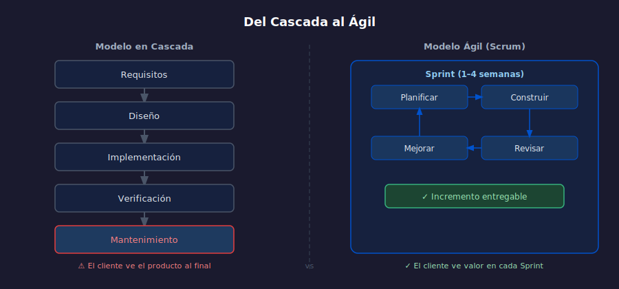

# 01 — La Crisis del Software y el Modelo en Cascada

## Objetivos

- Entender por qué los proyectos de software fallaban sistemáticamente antes del ágil
- Reconocer las etapas y limitaciones del modelo en cascada
- Relacionar la crisis del software con el surgimiento del Manifiesto Ágil

## Diagrama



## 1. La crisis del software

En los años 60 y 70, los proyectos de software se entregaban tarde,
sobre presupuesto o directamente no funcionaban. El informe **CHAOS Report**
de 1994 (Standish Group) lo confirmó con datos:

- Solo el **16%** de los proyectos terminaba a tiempo y dentro del presupuesto
- El **31%** se cancelaba antes de completarse
- El **53%** costaba casi el doble de lo estimado

El problema no era solo técnico: era de **proceso**.

## 2. El modelo en cascada

Formalizado por Winston Royce en 1970, el modelo en cascada divide el
desarrollo en fases secuenciales, donde cada fase debe terminar antes de
empezar la siguiente:

```
Requisitos → Diseño → Implementación → Verificación → Mantenimiento
```

**La trampa**: los requisitos se congelan al inicio. Cualquier cambio
posterior es costoso, lento y políticamente difícil.

## 3. Por qué falla en software

El software no es como construir un puente. Sus características únicas
lo hacen incompatible con el pensamiento en cascada:

- Los usuarios **no saben lo que quieren** hasta que ven algo funcionando
- Los requisitos **cambian** durante el desarrollo (negocio, mercado, ley)
- Los errores descubiertos al final **cuestan 100x más** que al inicio
- La integración al final del proyecto genera **sorpresas enormes**

> "El software es el único producto donde se acepta entregarlo roto
> y arreglarlo después." — anónimo de los 90s

## 4. El punto de quiebre: Utah, 2001

En febrero de 2001, 17 desarrolladores y consultores se reunieron en
Snowbird, Utah. Venían de distintas metodologías ligeras: XP, Scrum,
DSDM, Crystal. Compartían una frustración común con el cascada.

El resultado: el **Manifiesto para el Desarrollo Ágil de Software**,
firmado el 13 de febrero de 2001.

No era una metodología ni un proceso: era una declaración de valores
sobre **cómo debería funcionar el desarrollo de software**.

## Checklist

- [ ] ¿Puedes nombrar dos razones concretas por las que el cascada falla en software?
- [ ] ¿Sabes qué reveló el CHAOS Report de 1994?
- [ ] ¿Entiendes por qué los requisitos no se pueden "congelar" al inicio?
- [ ] ¿Puedes explicar qué ocurrió en Snowbird en 2001?

## Referencias

- [CHAOS Report — Standish Group](https://www.standishgroup.com/sample_research_files/chaos_report_1994.pdf)
- [Agile Manifesto — Historia oficial](https://agilemanifesto.org/history.html)
