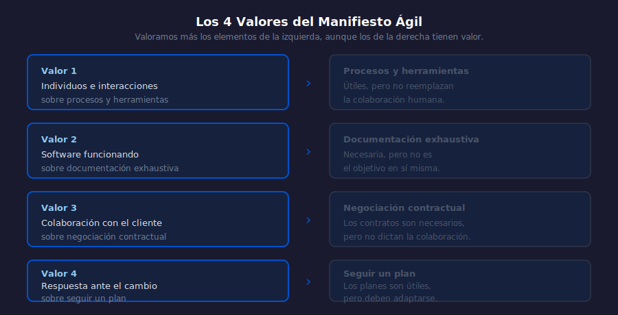

# 02 — El Manifiesto Ágil: Origen y los 4 Valores

## Objetivos

- Memorizar y comprender los 4 valores del Manifiesto Ágil
- Entender qué significa "valorar más" sin descartar lo de la derecha
- Aplicar los valores a situaciones concretas de un equipo

## Diagrama

## 1. El texto original

El Manifiesto Ágil tiene dos partes: los 4 valores y los 12 principios.
Los valores son la base filosófica; los principios, su aplicación práctica.

Texto original (traducción oficial al español):

> *"Estamos descubriendo formas mejores de desarrollar software tanto por
> nuestra propia experiencia como ayudando a terceros. A través de este
> trabajo hemos aprendido a valorar..."*

## 2. Los 4 valores

**Valor 1 — Individuos e interacciones** sobre procesos y herramientas

Un proceso perfecto con personas desmotivadas o incomunicadas fracasa.
Las herramientas apoyan, pero no reemplazan la colaboración humana.

**Valor 2 — Software funcionando** sobre documentación exhaustiva

El software que funciona es la medida principal de progreso. La
documentación sirve, pero no es el objetivo en sí misma.

**Valor 3 — Colaboración con el cliente** sobre negociación contractual

Involucrar al cliente durante todo el proceso produce mejores resultados
que definir todo en un contrato al inicio y no verlo hasta el final.

**Valor 4 — Respuesta ante el cambio** sobre seguir un plan

El cambio en los requisitos es una realidad del negocio. Un equipo ágil
lo abraza en lugar de resistirlo.

## 3. La frase clave que se malinterpreta

> *"...aunque valoramos los elementos de la derecha, valoramos más
> los de la izquierda."*

Esto NO significa ignorar procesos, documentación, contratos o planes.
Significa que cuando hay conflicto entre ambos lados, el equipo prioriza
el lado izquierdo.

**Ejemplo**: si el plan dice "entregar módulo X" pero el cliente necesita
ahora módulo Y de mayor valor, un equipo ágil responde al cambio.

## 4. Los valores en la práctica

| Situación                                      | Respuesta ágil                                  |
| ---------------------------------------------- | ----------------------------------------------- |
| El cliente pide un cambio a mitad del Sprint   | Dialogar; evaluar impacto; no bloquear con contrato |
| El equipo tiene documentación perfecta pero sin demo | Priorizar tener algo funcionando          |
| Dos devs resuelven un bug hablando 10 minutos  | Más valioso que abrir un ticket y esperar 2 días |

## Checklist

- [ ] ¿Puedes recitar los 4 valores de memoria en el orden correcto?
- [ ] ¿Entiendes por qué "valorar más" no significa "ignorar"?
- [ ] ¿Puedes dar un ejemplo propio de cada valor en acción?
- [ ] ¿Sabes qué diferencia a un equipo con mentalidad ágil de uno sin ella?

## Referencias

- [Manifiesto Ágil — texto oficial en español](https://agilemanifesto.org/iso/es/manifesto.html)
- [Los firmantes del Manifiesto](https://agilemanifesto.org/authors.html)
