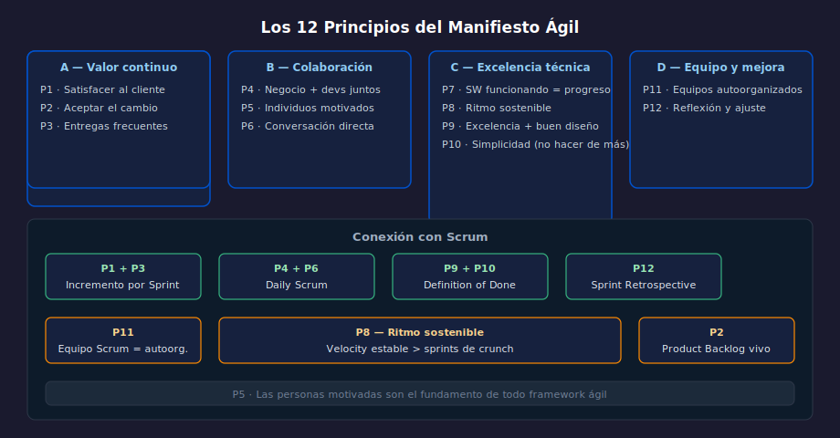

# 01 — Los 12 Principios del Manifiesto Ágil

## Objetivos

- Conocer los 12 principios del Manifiesto Ágil
- Agruparlos por temática para recordarlos más fácilmente
- Relacionar cada principio con situaciones de trabajo real

## Diagrama

## 1. Por qué existen los principios

Los 4 valores son la filosofía. Los 12 principios son su aplicación
concreta. Responden a la pregunta: ¿Cómo se ve el ágil en el día a día?

## 2. Grupo A — Entregar valor continuamente

**P1**: Nuestra mayor prioridad es satisfacer al cliente mediante la
entrega temprana y continua de software con valor.

**P2**: Aceptamos que los requisitos cambien, incluso en etapas tardías.
El cambio es una ventaja competitiva para el cliente.

**P3**: Entregamos software funcionando frecuentemente, en períodos de
dos semanas a dos meses, con preferencia por las escalas de tiempo más cortas.

## 3. Grupo B — Colaboración y personas

**P4**: Los responsables del negocio y los desarrolladores trabajamos
juntos de forma cotidiana durante todo el proyecto.

**P5**: Los proyectos se desarrollan en torno a individuos motivados.
Hay que darles el entorno, el apoyo y la confianza para que hagan su trabajo.

**P6**: El método más eficiente y efectivo de comunicar información es
la conversación cara a cara.

## 4. Grupo C — Excelencia técnica y diseño

**P7**: El software funcionando es la medida principal de progreso.

**P8**: Los procesos ágiles promueven el desarrollo sostenible. El ritmo
debe poder mantenerse de forma indefinida.

**P9**: La atención continua a la excelencia técnica y al buen diseño
mejora la agilidad.

**P10**: La simplicidad —maximizar la cantidad de trabajo no realizado—
es esencial.

## 5. Grupo D — Equipos que se autoorganizan y mejoran

**P11**: Las mejores arquitecturas, requisitos y diseños emergen de
equipos autoorganizados.

**P12**: A intervalos regulares el equipo reflexiona sobre cómo ser más
efectivo y ajusta su comportamiento en consecuencia.

## Checklist

- [ ] ¿Puedes recitar los 4 grupos y al menos 2 principios de cada uno?
- [ ] ¿Sabes cuál principio habla de ritmo sostenible?
- [ ] ¿Puedes explicar P10 (simplicidad) sin confundirlo con "hacer poco"?
- [ ] ¿Ves la conexión entre P12 y el evento de Retrospectiva en Scrum?

## Referencias

- [12 principios — texto oficial en español](https://agilemanifesto.org/iso/es/principles.html)
- [Explicación de cada principio — Agile Alliance](https://www.agilealliance.org/agile101/12-principles-behind-the-agile-manifesto/)
