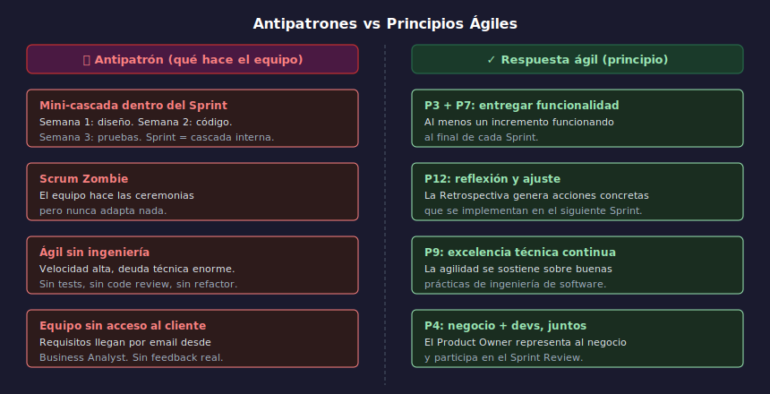

# 02 — Principios en Acción y Antipatrones

## Objetivos

- Reconocer cuándo un principio se aplica (o se viola) en situaciones reales
- Identificar antipatrones comunes asociados a cada grupo de principios
- Proponer correcciones concretas para cada antipatrón

## Diagrama

## 1. Principios que más se violan en la práctica

Los principios no se violan por mala voluntad: se violan porque los
hábitos del modelo en cascada son difíciles de erradicar.

**P1 violado**: el equipo entrega software completo solo al final del
proyecto, esperando que todo esté "perfecto" antes de mostrar algo.

**P4 violado**: el Product Owner solo aparece en la Review. El equipo
toma decisiones de negocio sin él durante el Sprint.

**P8 violado**: el equipo trabaja horas extra durante semanas de
"crunch" para cumplir fechas. La velocidad no es sostenible.

**P12 violado**: las retrospectivas se cancelan cuando hay presión.
Precisamente cuando más se necesitan.

## 2. Antipatrón: el "mini-cascada" dentro del Sprint

Síntoma: el Sprint empieza con 3 días de "diseño", luego 4 de "código"
y termina con 1 día de "testing". Son fases en cascada comprimidas.

Corrección: cada User Story debe fluir completa (diseño → código →
prueba) durante el Sprint, no en fases separadas.

## 3. Antipatrón: el "Scrum zombie"

Síntoma: el equipo ejecuta todos los eventos Scrum pero sin entender
su propósito. Las retrospectivas no producen acciones. El Daily es
un reporte. El Sprint Goal no existe.

Corrección: el P12 (reflexión regular) requiere honestidad. Un equipo
que no mejora después de cada Sprint no está siendo ágil.

## 4. Antipatrón: "ágil sin ingeniería"

Síntoma: en nombre de la velocidad, el equipo acumula deuda técnica.
El código degradado hace que cada Sprint sea más lento que el anterior.

Corrección: P9 (excelencia técnica) y P8 (ritmo sostenible) van de la
mano. La velocidad a largo plazo requiere calidad a corto plazo.

## Checklist

- [ ] ¿Puedes describir el antipatrón "mini-cascada" en el Sprint?
- [ ] ¿Sabes qué hace a un equipo "Scrum zombie"?
- [ ] ¿Entiendes por qué P9 y P8 son interdependientes?
- [ ] ¿Puedes proponer una corrección concreta para cada antipatrón?

## Referencias

- [Common Agile anti-patterns — Agile Alliance](https://www.agilealliance.org/glossary/anti-patterns/)
- [Scrum Anti-Patterns Guide — Stefan Wolpers](https://age-of-product.com/scrum-anti-patterns/)
