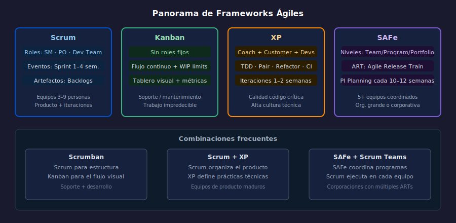

# 01 — Los principales frameworks ágiles

## Objetivos

- Conocer Scrum, Kanban, XP y SAFe como frameworks complementarios
- Identificar los elementos centrales de cada uno
- Evitar el error de creer que "ágil = Scrum"

---

## 1. Scrum

Scrum es un framework **iterativo e incremental** para gestionar trabajo complejo.
Define roles (Scrum Master, Product Owner, Equipo de Desarrollo), eventos
(Sprint, Planning, Daily, Review, Retro) y artefactos (Backlogs, Incremento).

**Cuándo usarlo**: equipos de 3–9 personas, producto con requisitos cambiantes,
entregables cada 1–4 semanas.

> La Scrum Guide tiene apenas 13 páginas. Todo lo que no está en esas 13 páginas
> es responsabilidad del equipo decidirlo. — Ken Schwaber

---

## 2. Kanban

Kanban es un método de gestión de flujo de trabajo basado en **visualización
y limitación del trabajo en curso (WIP)**. No prescribe roles ni timeboxes:
mejora el proceso existente de forma evolutiva.

**Cuándo usarlo**: equipos de soporte, mantenimiento, o trabajo de llegada
impredecible. También como complemento de Scrum (Scrumban).

---

## 3. XP — Extreme Programming

XP enfoca en la **excelencia técnica**. Define prácticas de ingeniería:
TDD (Test-Driven Development), Pair Programming, refactoring continuo,
integración continua e iteraciones cortas (1–2 semanas).

**Cuándo usarlo**: cuando la calidad del código es crítica, el equipo tiene
cultura técnica alta y los requisitos cambian muy frecuentemente.

---

## 4. SAFe — Scaled Agile Framework

SAFe permite aplicar principios ágiles en organizaciones grandes (100+ personas).
Introduce niveles: Team, Program y Large Solution / Portfolio. Usa ART
(Agile Release Train) para coordinar múltiples equipos Scrum.

**Cuándo usarlo**: organizaciones con 5+ equipos que necesitan sincronizarse
en un mismo producto o programa de trabajo.

---

## 5. Comparativa rápida

| Dimensión | Scrum | Kanban | XP | SAFe |
| --------- | ----- | ------ | -- | ---- |
| Roles definidos | Sí | No | Sí (Coach, Customer) | Sí (muchos) |
| Timeboxes | Sí (Sprint) | No | Sí (Iteración) | Sí (PI Planning) |
| Escala | 1 equipo | 1 equipo | 1 equipo | Múltiples equipos |
| Énfasis | Gestión producto | Flujo | Ingeniería | Coordinación |

---

## Checklist

- [ ] ¿Puedo nombrar los 3 pilares que distinguen Scrum de Kanban?
- [ ] ¿Sé qué práctica técnica es exclusiva de XP?
- [ ] ¿Entiendo por qué SAFe no aplica a un startup de 5 personas?
- [ ] ¿Reconozco que un equipo puede combinar frameworks?

---

## Referencias

- [Scrum Guide 2020](https://scrumguides.org/)
- [Kanban University](https://kanban.university/)
- [SAFe Framework](https://scaledagileframework.com/)
