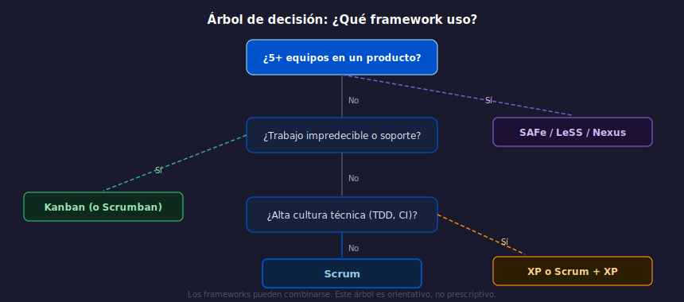

# 02 — Cuándo usar cada framework

## Objetivos

- Aplicar criterios concretos para elegir el framewok correcto
- Reconocer el antipatrón "framework de moda" (adoptar sin analizar contexto)
- Entender que los frameworks pueden combinarse

---

## 1. Preguntas clave antes de elegir

Antes de elegir un framework, el equipo debe responder 4 preguntas:

1. **¿El trabajo llega en lotes o de forma continua?**
   → Lotes predecibles: Scrum. Llegada continua: Kanban.

2. **¿Los requisitos cambian frecuentemente?**
   → Alta variabilidad + calidad crítica: XP. Alta variabilidad + gestión: Scrum.

3. **¿Cuántos equipos coordinan el mismo producto?**
   → 1 equipo: Scrum/Kanban/XP. 5+ equipos: explorar SAFe, LeSS o Nexus.

4. **¿La organización tiene cultura de mejora continua o necesita estructura primero?**
   → Cultura incipiente: Scrum (más prescriptivo). Cultura madura: Kanban.

---

## 2. Señales de alerta por contexto

### Scrum funciona mal cuando...
- El equipo trabaja en soporte 24/7 con interrupciones constantes
- Los Sprints siempre se cancelan por "urgencias del negocio"
- El PO no tiene tiempo para el backlog

### Kanban funciona mal cuando...
- El equipo no tiene disciplina para respetar los límites WIP
- Se necesita un Sprint Goal que alinee al equipo semanalmente
- No hay visibilidad del flujo (sin tablero, sin métricas)

### XP funciona mal cuando...
- El equipo no tiene cultura técnica para adoptar TDD
- Los stakeholders no participan directamente (XP requiere "Cliente en el lugar")
- La empresa no tiene herramientas de CI/CD mínimas

---

## 3. Combinaciones frecuentes

**Scrumban**: Scrum para estructura (Sprint, Retro) + Kanban para gestión visual
del flujo (WIP limits, tablero continuo). Funciona en equipos de soporte + producto.

**Scrum + XP**: Scrum organiza el trabajo, XP define las prácticas de ingeniería.
Esta combinación es muy común en equipos maduros de producto digital.

---

## 4. El antipatrón "cargo cult ágil"

> "Hacemos Scrum porque todos lo hacen."

Este antipatrón consiste en adoptar un framework porque es popular, sin analizar
si resuelve los problemas reales del equipo. Síntomas: reuniones que no generan
valor, artefactos que nadie usa, ceremonias sin propósito claro.

**La corrección**: elegir el framework en función del contexto, no de la moda.

---

## Checklist

- [ ] ¿Describí las características de mi equipo antes de elegir un framework?
- [ ] ¿Consideré al menos 2 alternativas y las descarté con argumentos?
- [ ] ¿Sé qué combinación de frameworks podría funcionar para mi contexto?
- [ ] ¿Puedo identificar el "cargo cult" si lo veo en un equipo?

---

## Referencias

- [Kanban vs Scrum — Mountain Goat Software](https://www.mountaingoatsoftware.com/agile)
- [SAFe vs LeSS — InfoQ](https://www.infoq.com/articles/scaling-agile-frameworks/)
