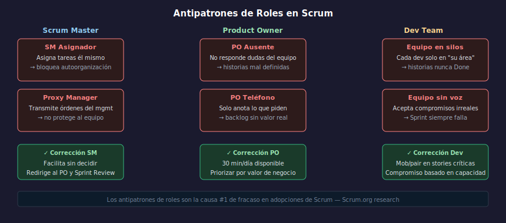

# 02 — Antipatrones de roles

## Objetivos

- Identificar los antipatrones más comunes en cada rol de Scrum
- Saber cómo corregirlos sin crear conflicto organizacional
- Entender la transición PM → SM desde dentro

---

## 1. Antipatrones del Scrum Master

### "El Scrum Master asignador"
El SM desglosa las User Stories en tareas y las asigna a los desarrolladores.
**Violación**: El equipo debe autoorganizarse y decidir quién hace qué.
**Corrección**: El SM facilita el Sprint Planning pero el equipo toma las decisiones.

### "El proxy manager"
El SM transmite las peticiones del management al equipo como si fuera un PM.
**Violación**: El SM protege al equipo del ruido externo; no es un canal de órdenes.
**Corrección**: Redirigir las peticiones externas al Sprint Review y al PO.

---

## 2. Antipatrones del Product Owner

### "El PO ausente"
El PO no está disponible durante el Sprint para responder dudas del equipo.
Las historias llegan incompletas o sin criterios de aceptación.
**Violación**: El PO debe estar disponible y tener autoridad para decidir.
**Corrección**: Reservar tiempo diario fijo para el equipo de desarrollo.

### "El PO teléfono"
El PO simplemente anota lo que piden los stakeholders y lo pone en el backlog.
No prioriza, no negocia, no rechaza. El backlog crece pero no entrega valor.
**Violación**: El PO debe maximizar el VALOR, no gestionar una lista de deseos.
**Corrección**: Introducir técnicas de priorización: MoSCoW, Value vs Effort.

---

## 3. Antipatrones del Equipo de Desarrollo

### "El equipo en silos"
Cada desarrollador trabaja solo en "su área". El backend no toca el frontend.
Las historias nunca están Done al final del Sprint porque siempre falta "la otra parte".
**Violación**: El equipo debe ser cross-functional y colaborar en cada historia.
**Corrección**: Mob programming en historias críticas; rotar responsabilidades.

### "El equipo sin voz"
El equipo acepta compromisos irreales del Sprint Planning sin objetar.
Después del Sprint se excusan en los impedimentos. Nunca escalaron nada.
**Violación**: El equipo es responsable de su Sprint Backlog; puede rechazar trabajo.
**Corrección**: El SM facilita conversaciones honestas sobre capacidad real.

---

## 4. La transición más difícil: PM → SM

| Project Manager | Scrum Master |
| --------------- | ------------ |
| Asigna tareas | Facilita autoorganización |
| Reporta avance al management | Protege al equipo del management |
| Es responsable de que se entregue | El equipo es responsable |
| Tiene autoridad jerárquica | Influye sin autoridad formal |

La transición no es un cambio de nombre: es un cambio de mentalidad.

---

## Checklist

- [ ] ¿Reconozco si el SM de mi equipo tiene comportamientos de PM?
- [ ] ¿El PO en mi equipo tiene autoridad real para rechazar peticiones?
- [ ] ¿El equipo habla en el Sprint Planning sobre capacidad honesta?
- [ ] ¿Sé qué habilidades debería tener el equipo para ser cross-functional?

---

## Referencias

- [Scrum.org — Common Scrum Master Antipatterns](https://www.scrum.org/resources)
