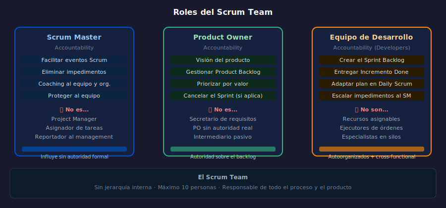

# Semana 04 — Roles de Scrum

**Etapa 0 · Fundamentos Ágiles** | Semanas 1–8 de 24

---

## Objetivos de la semana

- Distinguir las responsabilidades del Scrum Master, Product Owner y Equipo de Desarrollo
- Identificar antipatrones frecuentes en cada rol
- Comprender que los roles de Scrum son "accountabilities", no títulos jerárquicos

---

## Diagrama de referencia

---

## Distribución del tiempo (8 horas)

| Actividad | Tiempo |
| --------- | ------ |
| Teoría: los 3 roles y sus responsabilidades | 2 h |
| Práctica 01: Scrum Master vs Project Manager | 1.5 h |
| Práctica 02: Product Owner en conflicto | 1.5 h |
| Proyecto: describir los roles en tu dominio | 2 h |
| Glosario + recursos | 1 h |

---

## Contenido

### Teoría
- [01 — Los roles de Scrum](1-teoria/01-roles-scrum.md)
- [02 — Antipatrones de roles](1-teoria/02-antipatrones-roles.md)

### Prácticas
- [Práctica 01 — Scrum Master vs Project Manager](2-practicas/practica-01-sm-vs-pm/)
- [Práctica 02 — El Product Owner bajo presión](2-practicas/practica-02-po-bajo-presion/)

### Proyecto
- [Proyecto semanal: definir los roles para tu equipo](3-proyecto/)

### Recursos
- [Ebooks gratuitos](4-recursos/ebooks-free/)
- [Videografía](4-recursos/videografia/)
- [Webgrafía](4-recursos/webgrafia/)

### Glosario
- [Términos clave semana 04](5-glosario/)

---

## Navegación

| ← Anterior | → Siguiente |
| ---------- | ----------- |
| [Semana 03 — Frameworks Ágiles](../week-03/README.md) | [Semana 05 — Eventos de Scrum](../week-05/README.md) |
