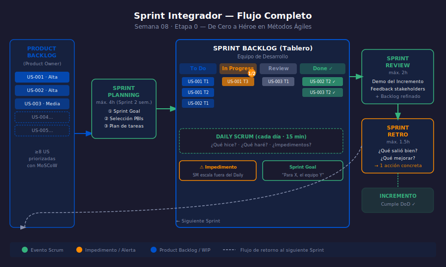

# Semana 08 — Proyecto Integrador Etapa 0

## Descripción

La semana 08 es el **Sprint de Integración**: aplicar en un ejercicio
completo todo lo aprendido en las semanas 01–07. El aprendiz facilita
(o simula) un Sprint completo desde la creación del Product Backlog
hasta la Retrospectiva, usando un tablero Kanban/Scrum y métricas básicas.

---

## Objetivos de Aprendizaje

Al finalizar esta semana serás capaz de:

1. Facilitar los 4 eventos de un Sprint completo (Planning, Daily, Review, Retro)
2. Construir y priorizar un Product Backlog con User Stories e ítems estimados
3. Identificar impedimentos y antipatrones durante la simulación
4. Crear un tablero visual (Scrum o Kanban) y medir el progreso del Sprint

---

## Distribución del Tiempo (8 horas)

| Actividad                               | Tiempo |
| --------------------------------------- | ------ |
| Revisión de conceptos clave (teoría)   | 1.5 h  |
| Práctica 1 — Sprint Planning simulado  | 2 h    |
| Práctica 2 — Daily + Review + Retro    | 2 h    |
| Proyecto integrador                    | 2.5 h  |

---

## Diagrama de la Semana

---

## Contenido

### Teoría

- [01 — Cómo integrar Scrum y Kanban](1-teoria/01-integracion-scrum-kanban.md)
- [02 — Checklist del Sprint completo](1-teoria/02-checklist-sprint.md)

### Prácticas

- [Práctica 01 — Sprint Planning completo](2-practicas/practica-01-sprint-planning/README.md)
- [Práctica 02 — Daily, Review y Retro en secuencia](2-practicas/practica-02-sprint-eventos/README.md)

### Proyecto

- [Sprint 1 de tu producto](3-proyecto/README.md)

---

## Navegación

| ← Anterior | Etapa | Siguiente → |
| --- | --- | --- |
| [Semana 07 — Introducción a Kanban](../week-07/README.md) | **Etapa 0** | [Semana 09 — User Stories](../week-09/README.md) |
