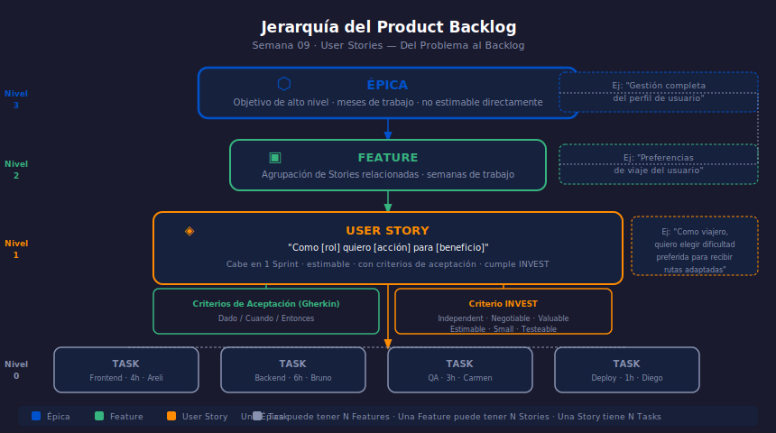

# Semana 09 — User Stories: Del Problema al Backlog

## Descripción

Aprenderás a escribir User Stories que capturen valor real del usuario.
Aplicarás el criterio **INVEST**, los criterios de aceptación en formato
**Gherkin** y entenderás la jerarquía Épica → Feature → Story → Task.

---

## Objetivos de Aprendizaje

1. Redactar User Stories en formato `Como [rol] quiero [acción] para [beneficio]`
2. Evaluar User Stories con el criterio INVEST (6 dimensiones)
3. Escribir criterios de aceptación en Gherkin (Dado/Cuando/Entonces)
4. Diferenciar Épicas, Features, Stories y Tasks en el backlog

---

## Distribución del Tiempo (8 horas)

| Actividad | Tiempo |
| --------- | ------ |
| Teoría — Anatomía de una User Story | 1.5 h |
| Teoría — INVEST y criterios de aceptación | 1 h |
| Práctica 1 — Diagnosis: User Stories con defectos | 2 h |
| Práctica 2 — Escritura con Gherkin | 2 h |
| Proyecto — Product Backlog con historias de calidad | 1.5 h |

---

## Diagrama de la Semana

---

## Contenido

### Teoría

- [01 — Anatomía de una User Story](1-teoria/01-anatomia-user-story.md)
- [02 — INVEST y criterios de aceptación](1-teoria/02-invest-gherkin.md)

### Prácticas

- [Práctica 01 — Diagnosis: identificar User Stories defectuosas](2-practicas/practica-01-diagnosis-stories/README.md)
- [Práctica 02 — Escritura con criterios de aceptación Gherkin](2-practicas/practica-02-escritura-gherkin/README.md)

### Proyecto

- [Backlog con User Stories de calidad](3-proyecto/README.md)

---

## Navegación

| ← Anterior | Etapa | Siguiente → |
| --- | --- | --- |
| [Semana 08 — Integrador Etapa 0](../week-08/README.md) | **Etapa 1** | [Semana 10 — Estimación Ágil](../week-10/README.md) |
