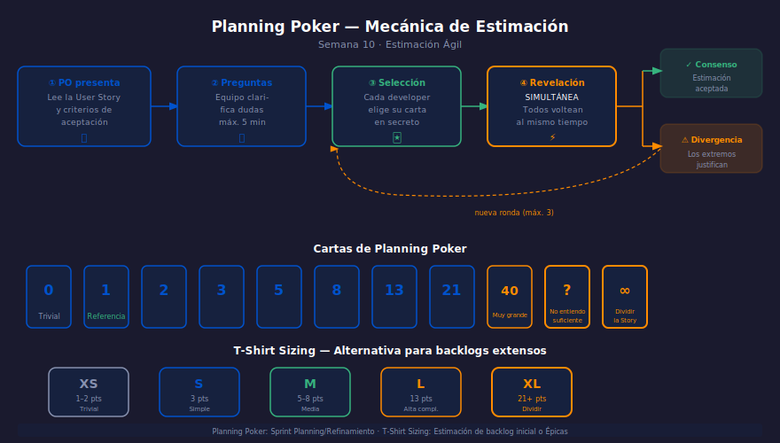

# Semana 10 — Estimación Ágil: Puntos, Tallas y Planning Poker

## Descripción

Aprenderás a estimar el esfuerzo de User Stories utilizando técnicas
ágiles: Story Points, T-Shirt Sizing y Planning Poker. Entenderás
por qué la estimación relativa funciona mejor que la estimación en horas.

---

## Objetivos de Aprendizaje

1. Explicar por qué los Story Points funcionan mejor que las horas
2. Usar la secuencia de Fibonacci modificada para estimar
3. Facilitar una sesión de Planning Poker con el equipo
4. Calcular la Velocity inicial de un equipo nuevo

---

## Distribución del Tiempo (8 horas)

| Actividad | Tiempo |
| --------- | ------ |
| Teoría — Story Points y estimación relativa | 1.5 h |
| Teoría — Planning Poker y T-Shirt Sizing | 1 h |
| Práctica 1 — Sesión de Planning Poker simulada | 2 h |
| Práctica 2 — Calibración de velocidad del equipo | 2 h |
| Proyecto — Backlog estimado completo | 1.5 h |

---

## Diagrama de la Semana

---

## Contenido

### Teoría

- [01 — Story Points y estimación relativa](1-teoria/01-story-points.md)
- [02 — Planning Poker y T-Shirt Sizing](1-teoria/02-planning-poker.md)

### Prácticas

- [Práctica 01 — Sesión de Planning Poker](2-practicas/practica-01-planning-poker/README.md)
- [Práctica 02 — Calibración de velocidad](2-practicas/practica-02-velocidad/README.md)

### Proyecto

- [Backlog estimado del producto](3-proyecto/README.md)

---

## Navegación

| ← Anterior | Etapa | Siguiente → |
| --- | --- | --- |
| [Semana 09 — User Stories](../week-09/README.md) | **Etapa 1** | [Semana 11 — Sprint Planning](../week-11/README.md) |
