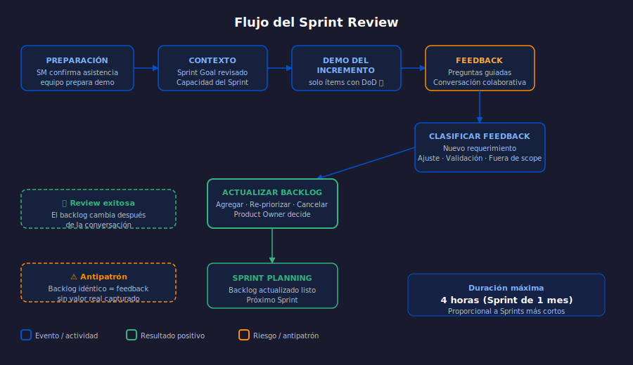

# Semana 14: Sprint Review con Stakeholders

**Etapa 1: Scrum Practicante** | Semanas 9–16 | 8 horas

---

## ¿Qué aprenderás esta semana?

1. Facilitar un Sprint Review efectivo con stakeholders externos
2. Distinguir entre Sprint Review y Sprint Demo — y por qué importa
3. Preparar y estructurar la agenda de un Sprint Review de 4 horas
4. Capturar feedback de stakeholders y actualizar el Product Backlog

---

## Diagrama de referencia

---

## Distribución del tiempo (8 horas)

| Actividad | Tiempo |
| --------- | ------ |
| Teoría: qué ES y qué NO ES el Sprint Review | 1h |
| Teoría: agenda y facilitación con stakeholders | 1h |
| Práctica 1: Detectar antipatrones en un Sprint Review fallido | 1.5h |
| Práctica 2: Ejecutar una Review con feedback estructurado | 1.5h |
| Proyecto integrador | 2h |
| Glosario y recursos | 1h |

---

## Contenido de la semana

- [Teoría 01: Sprint Review — Propósito y Antipatrones](1-teoria/01-sprint-review-proposito.md)
- [Teoría 02: Facilitación y Captura de Feedback](1-teoria/02-facilitacion-feedback.md)
- [Práctica 01: TravelNow — Review del Sprint 3](2-practicas/practica-01-antipatrones-review/)
- [Práctica 02: CivicPulse — Feedback y Backlog Update](2-practicas/practica-02-feedback-backlog/)
- [Proyecto: Sprint Review en tu dominio](3-proyecto/)
- [Recursos adicionales](4-recursos/)
- [Glosario](5-glosario/README.md)

---

## Navegación

← [Semana 13: Impedimentos y Deuda Técnica](../week-13/README.md)
→ [Semana 15: Retrospectivas Avanzadas](../week-15/README.md)
