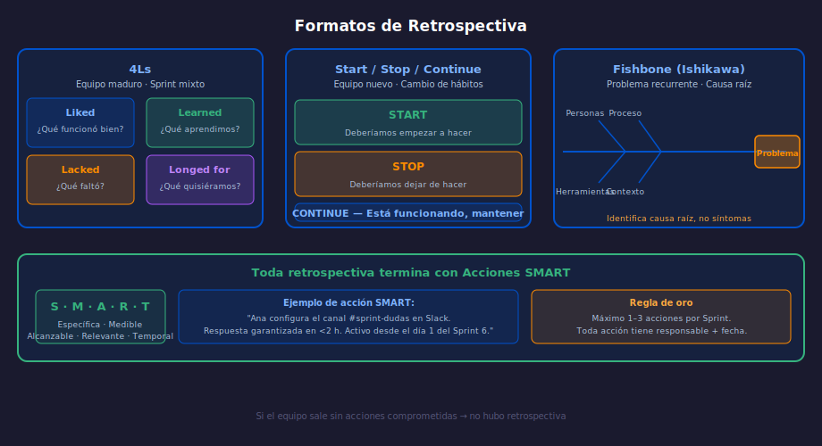

# Semana 15: Retrospectivas Avanzadas

**Etapa 1: Scrum Practicante** | Semanas 9–16 | 8 horas

---

## ¿Qué aprenderás esta semana?

1. Distinguir entre retrospectivas superficiales y retrospectivas transformadoras
2. Aplicar 3 formatos avanzados: 4Ls, Fishbone y Start/Stop/Continue
3. Redactar acciones de mejora SMART con seguimiento en el próximo Sprint
4. Manejar situaciones difíciles en retrospectivas (silencio, conflicto, cinismo)

---

## Diagrama de referencia

---

## Distribución del tiempo (8 horas)

| Actividad | Tiempo |
| --------- | ------ |
| Teoría: propósito y formatos avanzados de retrospectiva | 1h |
| Teoría: acciones SMART y seguimiento | 1h |
| Práctica 1: Analizar una retrospectiva fallida y reformularla | 1.5h |
| Práctica 2: Facilitar una retrospectiva con 4Ls y acciones SMART | 1.5h |
| Proyecto integrador | 2h |
| Glosario y recursos | 1h |

---

## Contenido de la semana

- [Teoría 01: Propósito y Formatos Avanzados](1-teoria/01-proposito-formatos.md)
- [Teoría 02: Acciones SMART y Seguimiento](1-teoria/02-acciones-smart-seguimiento.md)
- [Práctica 01: FlowPath — Diagnóstico de Retrospectiva Fallida](2-practicas/practica-01-retro-fallida/)
- [Práctica 02: MediaBridge — Facilitar con 4Ls](2-practicas/practica-02-4ls-acciones/)
- [Proyecto: Retrospectiva completa en tu dominio](3-proyecto/)
- [Recursos adicionales](4-recursos/)
- [Glosario](5-glosario/README.md)

---

## Navegación

← [Semana 14: Sprint Review con Stakeholders](../week-14/README.md)
→ [Semana 16: Proyecto Integrador Etapa 1](../week-16/README.md)
