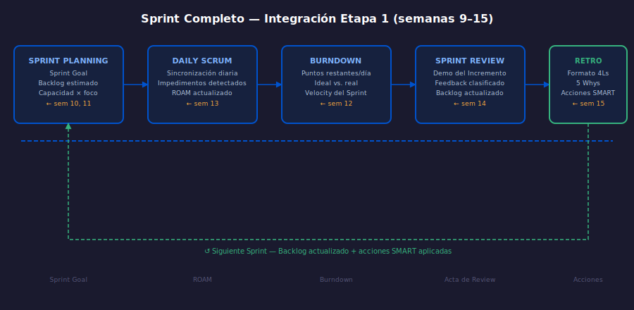

# Semana 16: Proyecto Integrador — Etapa 1

**Cierre de Etapa 1: Scrum Practicante** | Semana 16 de 24 | 8 horas

---

## ¿Qué es esta semana?

La semana 16 es el **cierre de la Etapa 1**. No hay teoría nueva.
Esta semana consolidas todo lo aprendido en las semanas 9–15 ejecutando
un Sprint completo de tu producto: desde el Sprint Planning hasta la Retrospectiva.

---

## Diagrama de referencia

---

## Lo que vas a integrar

| Semana | Concepto | Artefacto en esta sem. |
| ------ | -------- | ---------------------- |
| 10 | Estimación ágil | Sprint Backlog estimado |
| 11 | Sprint Planning avanzado | Sprint Goal + capacidad |
| 12 | Métricas | Burndown del Sprint |
| 13 | Impedimentos | Registro ROAM |
| 14 | Sprint Review | Acta de Review con feedback |
| 15 | Retrospectiva | Acciones SMART |

---

## Distribución del tiempo (8 horas)

| Actividad | Tiempo |
| --------- | ------ |
| Revisión teórica rápida (resumen semanas 9–15) | 0.5h |
| Sprint Planning del Sprint 2 (tu producto) | 1.5h |
| Simulación de Sprint (Daily + impedimentos) | 1.5h |
| Sprint Review con stakeholders ficticios | 1.5h |
| Retrospectiva con acciones SMART | 1h |
| Revisión de métricas (Burndown del Sprint) | 1h |
| Autoevaluación y ajuste del backlog | 1h |

---

## Contenido de la semana

- [Repaso: Mapa de la Etapa 1](1-teoria/01-repaso-etapa-1.md)
- [Práctica 01: Ejemplo de Sprint Completo — CropLink](2-practicas/practica-01-sprint-completo/)
- [Proyecto: Tu Sprint 2 completo](3-proyecto/)
- [Rúbrica y Autoevaluación](rubrica-evaluacion.md)

---

## Criterio de finalización de Etapa 1

Para cerrar la Etapa 1, necesitas entregar:

- [ ] Sprint Planning documentado (Sprint Goal + backlog estimado + capacidad)
- [ ] Registro de al menos 1 impedimento con ROAM
- [ ] Burndown del Sprint con datos reales o simulados
- [ ] Acta de Sprint Review con feedback de stakeholders
- [ ] Retrospectiva con 2 acciones SMART

---

## Navegación

← [Semana 15: Retrospectivas Avanzadas](../week-15/README.md)
→ [Semana 17: Scaled Agile — SAFe, LeSS, Nexus](../week-17/README.md)
