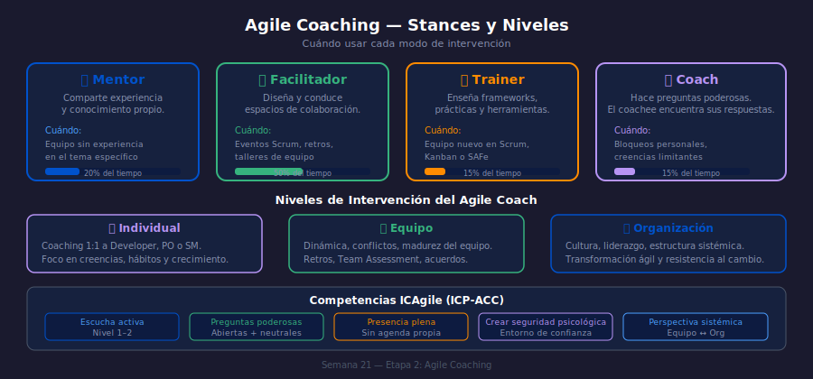

# Semana 21 — Agile Coaching: Niveles, Stances y Conversaciones

## ¿Qué aprenderás esta semana?

1. Diferenciar los 4 stances del Agile Coach: mentor, facilitador, trainer y coach
2. Comprender los niveles de coaching: individual, equipo y organizacional
3. Aplicar técnicas de conversación de coaching (preguntas poderosas, escucha activa)
4. Reconocer cuándo usar cada stance según la situación

---

## Diagrama de Referencia

---

## Distribución del Tiempo (8 horas)

| Actividad | Tiempo |
|-----------|--------|
| Teoría: Stances del Agile Coach | 1.5 h |
| Teoría: Niveles y conversaciones | 1.0 h |
| Práctica 01: Identificar stance correcto | 1.5 h |
| Práctica 02: Conversación de coaching | 1.5 h |
| Proyecto integrador | 2.0 h |
| Revisión del glosario | 0.5 h |

---

## Contenido de la Semana

| Sección | Tema |
|---------|------|
| `1-teoria/01-coaching-stances.md` | Los 4 stances: cuándo usar cada uno |
| `1-teoria/02-niveles-conversaciones.md` | Coaching individual, de equipo y organizacional |
| `2-practicas/practica-01-stances/` | CivicHub — 3 escenarios, 1 stance por escenario |
| `2-practicas/practica-02-conversacion/` | HealthCore — sesión de coaching con Developer bloqueado |
| `3-proyecto/` | Proyecto integrador: plan de coaching para tu equipo |
| `4-recursos/` | eBooks, videos y referencias sobre Agile Coaching |
| `5-glosario/` | Términos de coaching ágil (A–Z) |

---

## Navegación

← [Semana 20 — OKRs y Métricas de Valor](../week-20/README.md) |
[Semana 22 — Facilitación Avanzada](../week-22/README.md) →
