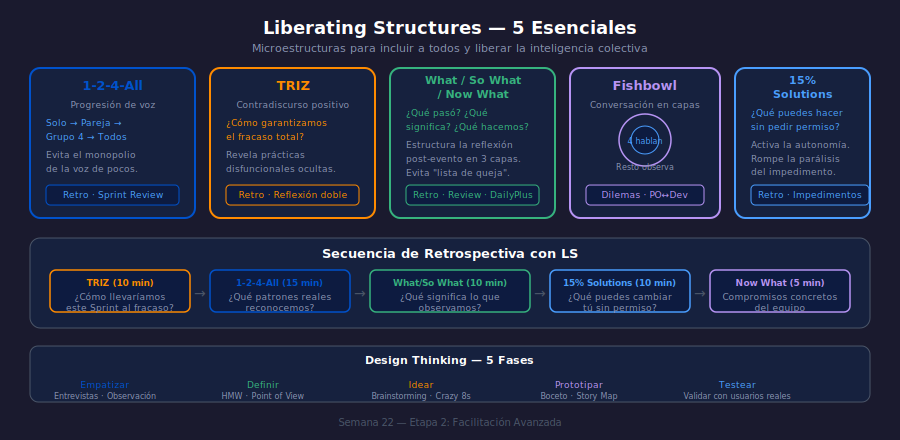

# Liberating Structures — 5 Microestructuras Esenciales

**Semana 22 | Etapa 2: Ágil Avanzado**

## Objetivos

1. Conocer el propósito de cada una de las 5 LS esenciales
2. Seleccionar la LS correcta para cada tipo de situación
3. Diseñar una secuencia de LS encadenadas para una Retrospectiva

---

## Diagrama de Referencia

---

## 1. ¿Por qué Liberating Structures?

Las LS son 33 microestructuras de facilitación diseñadas para incluir a todos los
participantes y liberar la inteligencia colectiva del grupo. Fueron desarrolladas por
Keith McCandless y Henri Lipmanowicz.

**El problema que resuelven**: En la mayoría de las reuniones, el 80% de la
conversación la dominan el 20% de las personas (generalmente las de mayor jerarquía
o mayor extroversión). Las LS estructuran la participación para evitar este sesgo.

---

## 2. 1-2-4-All

**Propósito**: Asegurar que todos tengan voz antes de que el grupo decida.

**Secuencia**: 1 min reflexión individual → 2 min en pareja → 4 min en grupo de 4 → toda la sala.

**Cuándo usarla**: Al inicio de una Retrospectiva para recoger observaciones del Sprint
antes de que alguien "contamine" la conversación con su opinión. En un Sprint Planning
para generar ideas de descomposición de tareas.

> **Escenario**: El facilitador pregunta "¿Cuál fue el mayor freno del Sprint?" y pide
> 1 min de reflexión silenciosa a cada persona. Las ideas emergen sin el filtro social
> de "no quiero parecer quejoso frente al Tech Lead".

---

## 3. TRIZ

**Propósito**: Revelar prácticas disfuncionales que el equipo no quiere nombrar directamente.

**Secuencia**: Pregunta inversa → lista de acciones para garantizar el fracaso →
reconocer cuáles ya están haciendo → comprometerse a dejar de hacerlas.

**La pregunta clave**: **"¿Cómo garantizaríamos con certeza total que este Sprint falla?"**

**Cuándo usarla**: Cuando el equipo tiene problemas recurrentes pero nadie los nombra en
la Retro. El formato inverso reduce el miedo a la crítica directa.

> **Escenario**: El equipo de FintechFly responde "comunicarse solo por tickets cerrados",
> "no hablar de impedimentos hasta que sea un incendio", "no documentar nada". De repente
> todos se ríen porque reconocen que hacen exactamente eso.

---

## 4. What / So What / Now What (W³)

**Propósito**: Estructurar la reflexión en tres capas: hechos → interpretación → acción.

**Secuencia temporal**:
- **What**: ¿Qué observamos? (datos, comportamientos, hechos)
- **So What**: ¿Qué significa para nosotros? (patrones, causas, impacto)
- **Now What**: ¿Qué haremos diferente? (compromisos, acciones)

**Cuándo usarla**: Al cierre de una Sprint Review para que el equipo procese el feedback
de los stakeholders. Después de un incidente o bug en producción.

**Antipatrón**: Saltar el "So What" e ir directo de observaciones a acciones.
El equipo actúa sobre síntomas sin entender la causa.

---

## 5. Fishbowl

**Propósito**: Facilitar conversaciones difíciles o de alta carga política con todos
presente pero sin que todos hablen al mismo tiempo.

**Estructura**: 4 sillas en el centro (los que hablan), el resto observa. Una silla
siempre vacía = cualquiera puede entrar. Se rota.

**Cuándo usarla**: Conflictos entre PO y equipo de desarrollo. Conversaciones sobre
cambios organizacionales. Temas tabú que nadie quiere traer al plenario.

---

## 6. 15% Solutions

**Propósito**: Activar la autonomía individual frente a los impedimentos sistémicos.

**La pregunta**: **"¿Qué puedes hacer tú, ahora mismo, dentro de tu esfera de control,
sin pedir permiso ni presupuesto?"**

**Por qué funciona**: La gente tiende a ver los problemas como externos ("el proceso",
"la empresa", "el cliente"). El 15% localiza lo que sí pueden cambiar hoy.

> **Escenario**: El equipo se queja de que los deploys manuales desperdician tiempo.
> En lugar de esperar que IT automatice, cada Developer identifica su 15%: uno propone
> documentar los pasos en Confluence esta misma tarde; otro dice que puede revisar si
> hay scripts existentes sin usar.

---

## Checklist

- [ ] ¿Puedo nombrar el propósito de cada una de las 5 LS?
- [ ] ¿Sé cuándo es mejor usar TRIZ vs 1-2-4-All?
- [ ] ¿Entiendo la diferencia entre What/So What y Start/Stop/Continue?
- [ ] ¿Puedo diseñar una secuencia de 3 LS para una Retro de 45 minutos?

---

## Referencias

- [Liberating Structures — catálogo completo](https://www.liberatingstructures.com/)
- McCandless & Lipmanowicz — *The Surprising Power of Liberating Structures* (2014)
