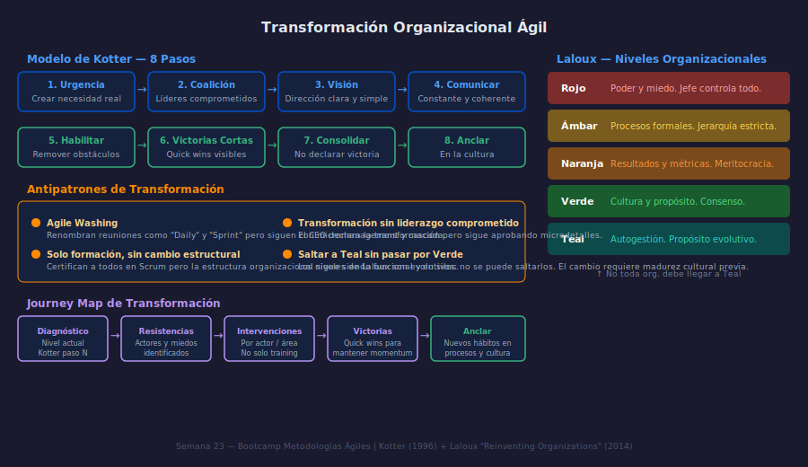

# El Modelo de Kotter — 8 Pasos para el Cambio

**Semana 23 | Transformación Organizacional Ágil**

---

## Objetivos

- Comprender por qué la mayoría de las transformaciones ágiles fracasan
- Aplicar el modelo de 8 pasos de Kotter para diagnosticar y desbloquear transformaciones
- Reconocer los antipatrones más frecuentes en la adopción de ágil a escala

---

## 1. Por qué fallan las transformaciones ágiles

Casi el 70% de las iniciativas de cambio organizacional no alcanzan sus objetivos. No es por falta de frameworks ni de certificaciones. Las causas reales son:

- Liderazgo no comprometido más allá de las palabras
- Urgencia fabricada en lugar de sentida por el equipo
- Cambio de nombres sin cambio de estructuras de poder

La transformación ágil no es un proyecto de IT. Es un cambio cultural.

---

## 2. Los 8 Pasos de Kotter

John Kotter estudió 100 transformaciones organizacionales y encontró 8 factores comunes en las exitosas. Los pasos son secuenciales y acumulativos.

**Fase 1 — Crear las condiciones:**

1. **Crear urgencia real**: El equipo debe sentir, no solo saber, que el cambio es necesario. Mostrar datos concretos: "Nuestro time-to-market es 4x más lento que el mercado."
2. **Formar una coalición guía**: Un solo líder no puede llevar la transformación. Se necesita un grupo diverso con influencia real.
3. **Desarrollar la visión**: Una visión clara y simple que cualquier persona pueda repetir en 2 minutos.
4. **Comunicar la visión constantemente**: No como anuncio sino como conversación cotidiana.

**Fase 2 — Hacer que suceda:**

5. **Habilitar la acción**: Remover obstáculos estructurales: políticas de aprobación, métricas de desempeño individual que premian el silo.
6. **Generar victorias de corto plazo**: Resultados visibles en 3–6 meses para mantener el momentum.
7. **Consolidar y acelerar**: No declarar victoria prematuramente. Usar el momentum para abordar resistencias más profundas.
8. **Anclar en la cultura**: El cambio se vuelve sostenible cuando los nuevos comportamientos son "cómo hacemos las cosas aquí."

---

## 3. ¿En qué paso está bloqueada tu transformación?

> **Escenario**: Una empresa tecnológica capacitó a 200 personas en Scrum. Los equipos hacen dailies y sprint reviews. Pero los managers siguen asignando tareas directamente a desarrolladores y midiendo horas facturadas. A los 6 meses, los equipos están frustrados.
>
> **Diagnóstico**: La transformación está bloqueada en el **Paso 5 (Habilitar)**. La estructura de incentivos y de gestión no cambió. Los rituales de Scrum son decorativos.

---

## 4. Antipatrones frecuentes

| Antipatrón | Por qué falla |
|---|---|
| Agile Washing | Solo cambian los nombres, no el poder ni los procesos |
| Solo formación | Sin cambios estructurales, los hábitos viejos dominan |
| Sin coalición real | Un entusiasta no puede transformar una organización |
| Victoria prematura | Declarar éxito en el paso 6 detiene el proceso |

---

## Checklist

- ¿Puedo identificar en qué paso de Kotter está bloqueada una transformación real?
- ¿La urgencia que describe la organización es sentida o solo declarada?
- ¿La coalición guía tiene influencia real o solo título formal?
- ¿Los incentivos del sistema refuerzan el cambio o lo sabotean?

---

## Referencias

- Kotter, J.P. (1996). *Leading Change*. Harvard Business Review Press
- https://www.kotterinc.com/methodology/8-steps/
