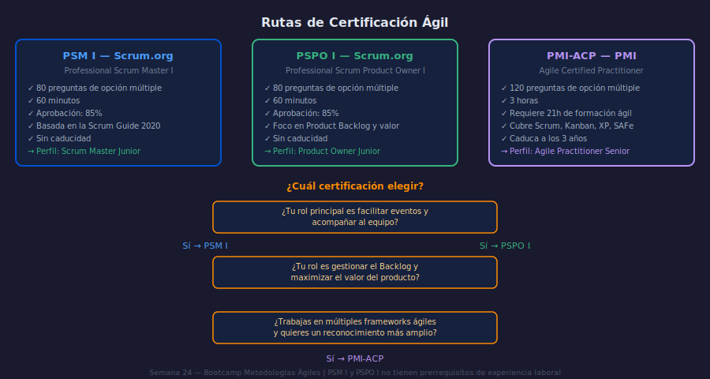

# Certificaciones Ágiles: Rutas y Preparación

**Semana 24 | Capstone y Certificaciones**

---

## Objetivos

- Comparar las principales certificaciones ágiles y elegir la más adecuada según perfil
- Entender el formato y los focos de evaluación de PSM I y PSPO I
- Identificar las áreas de mayor dificultad en los exámenes basados en la Scrum Guide

---

## 1. ¿Qué certifica cada examen?

Las certificaciones ágiles no certifica que seas un buen Scrum Master. Certifican que entiendes el framework según su guía oficial. La diferencia es importante: el examen pregunta qué dice la Scrum Guide, no qué harías tú intuitivamente.

**PSM I (Scrum.org)**: 80 preguntas, 60 minutos, aprobación en 85%. Foco: roles, eventos, artefactos, compromisos y valores de Scrum tal como los define la Scrum Guide 2020.

**PSPO I (Scrum.org)**: Mismo formato. Foco: Product Backlog management, Sprint Goal, valor del producto, relación con stakeholders, criterios de ordenamiento.

**PMI-ACP (PMI)**: 120 preguntas, 3 horas. Cubre Scrum, Kanban, XP, SAFe, Lean. Requiere 21 horas de formación ágil documentadas y experiencia en proyectos (opcional para algunos perfiles).

---

## 2. Los errores más frecuentes en PSM I

La Scrum Guide es contraintuitiva en varios puntos. Estas son las trampas más comunes:

**Trampa 1**: "El Scrum Master gestiona el equipo."
→ Falso. El Scrum Master sirve al equipo, al Product Owner y a la organización. No gestiona personas.

**Trampa 2**: "El Sprint Backlog pertenece al Product Owner."
→ Falso. El Sprint Backlog pertenece al equipo de desarrollo (Developers). El PO no puede modificarlo durante el Sprint.

**Trampa 3**: "El Daily Scrum debe durar exactamente 15 minutos."
→ La Scrum Guide dice "máximo 15 minutos." No es un requisito de exactitud.

**Trampa 4**: "Si el Sprint Goal ya no es válido, se cancela el Sprint."
→ Solo el Product Owner puede cancelar el Sprint, y solo si el Sprint Goal queda obsoleto.

---

## 3. Estrategia de preparación

| Semana | Actividad |
|--------|-----------|
| 1–2 | Leer la Scrum Guide 2020 completa 3 veces (son 13 páginas) |
| 3 | Hacer 2 simulacros en open.scrum.org — identificar áreas débiles |
| 4 | Repasar solo las áreas con errores. Nuevo simulacro. |

La preparación efectiva es de 4 semanas de práctica constante, no de memorización de la guía.

---

## Checklist

- ¿Identifiqué el perfil de certificación más adecuado para mi rol actual?
- ¿Conozco las 3 trampas más comunes del PSM I?
- ¿Leí la Scrum Guide 2020 completa al menos una vez?
- ¿Completé al menos un simulacro de examen?

---

## Referencias

- Scrum Guide 2020: https://scrumguides.org/
- Simulacros PSM I: https://www.scrum.org/open-assessments
- PMI-ACP: https://www.pmi.org/certifications/agile-acp
